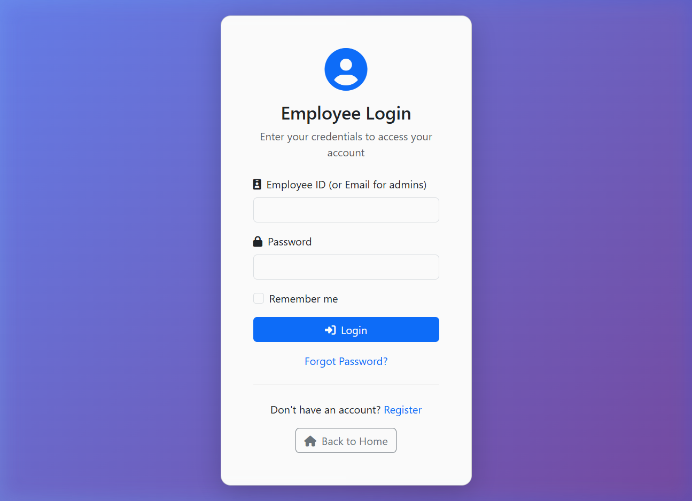
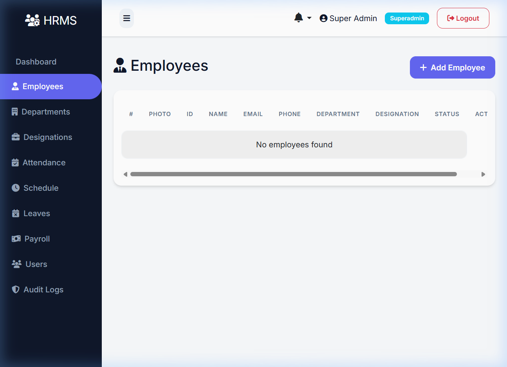
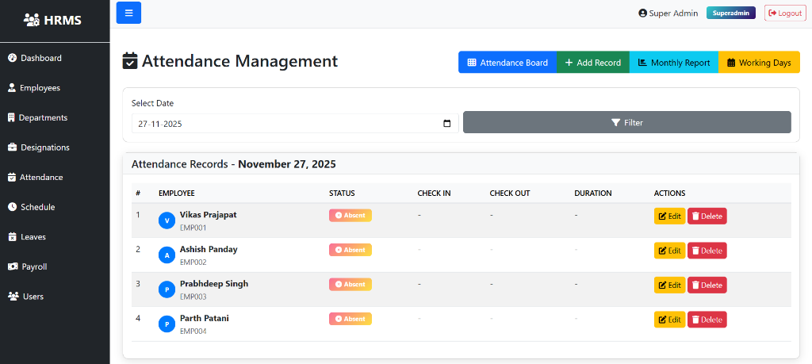
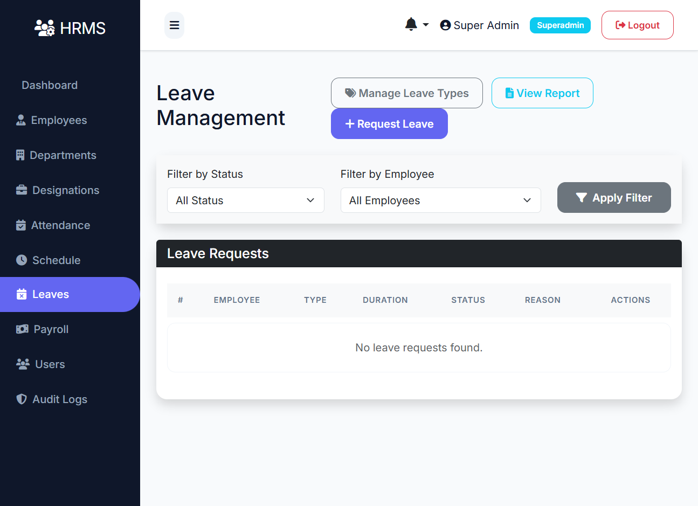
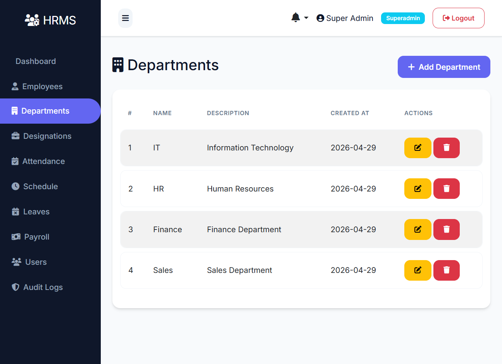
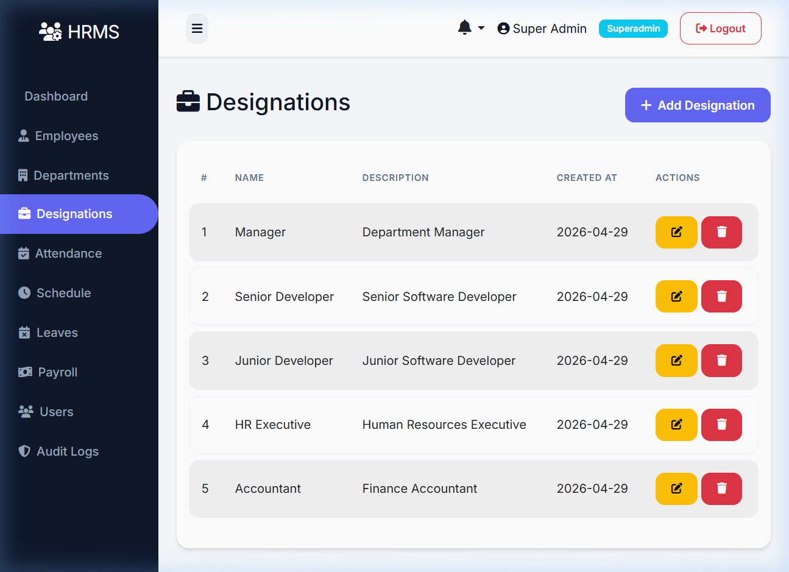

# 🏢 Advanced Human Resource Management System (HRMS)

A powerful, modernized HRMS built with **Python Flask** and **Bootstrap 5**. This system provides a comprehensive suite of tools for managing employees, attendance, leaves, and payroll with a premium user experience.

---

## 🌟 Key Features

### 📊 Modernized Dashboard
- **Admin Insight Dashboard**: A high-fidelity overview of organization performance.
- **Real-time Analytics**: Interactive charts for Salary trends, Attendance status, and Leave insights.
- **Quick Actions**: Centralized control center for frequent administrative tasks.

### 📅 Smart Attendance System
- **Automated Generation**: Intelligent engine that auto-populates attendance for weekends, holidays, and approved leaves.
- **Holiday Intelligence**: Integrated holiday management that automatically reconciles attendance statuses.
- **Monthly Reporting**: Detailed performance reports with KPI summaries and visual calendars.

### 💼 Employee & Office Management
- **Full Employee Lifecycle**: From onboarding to payroll processing.
- **Organizational Structure**: Manage Departments, Designations, and Working Schedules.
- **Audit Logs**: Full traceability of manual system modifications.

---

## 📸 Feature Gallery

| Login & Authentication | Admin Dashboard |
|:---:|:---:|
|  |  |

| Employee Management | Attendance Dashboard |
|:---:|:---:|
|  |  |

| Monthly Reporting (v2) | Leave Management |
|:---:|:---:|
|  |  |

| Department Organization | Designation Management |
|:---:|:---:|
|  |  |

---

## 🚀 Quick Start

### 1. Environment Setup
```powershell
# Create and activate virtual environment
python -m venv .venv
.venv\Scripts\activate

# Install dependencies
pip install -r requirements.txt
```

### 2. Configuration
Create a `.env` file in the root directory:
```env
SECRET_KEY=your_secret_key
DATABASE_URL=sqlite:///instance/employee_management.db
```

### 3. Database Initialization
```powershell
$env:FLASK_APP = 'app.py'
flask db upgrade
python scripts/seed_2026_holidays.py  # Populate 2026 calendar
```

### 4. Launch
```powershell
python app.py
```
Access the system at `http://127.0.0.1:5000`

---

## 🛠️ Tech Stack
- **Backend**: Flask (Python)
- **Database**: SQLAlchemy (MySQL / SQLite)
- **Frontend**: Bootstrap 5, Chart.js, FontAwesome 6
- **Auth**: Flask-Login, Bcrypt
- **Migrations**: Flask-Migrate (Alembic)

---

## 📝 License
This project is licensed under the MIT License.
