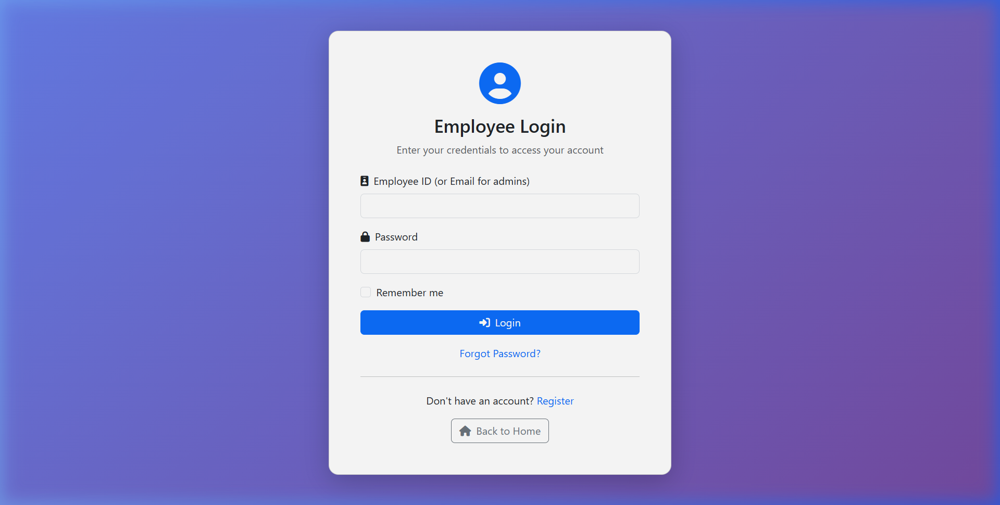
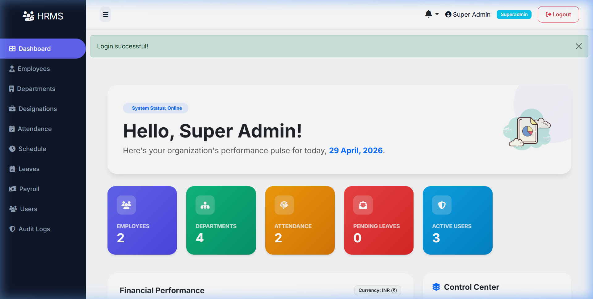
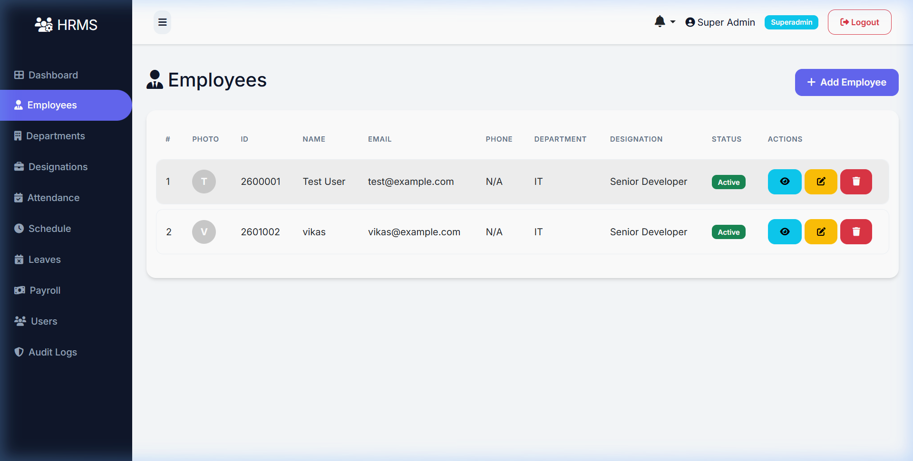
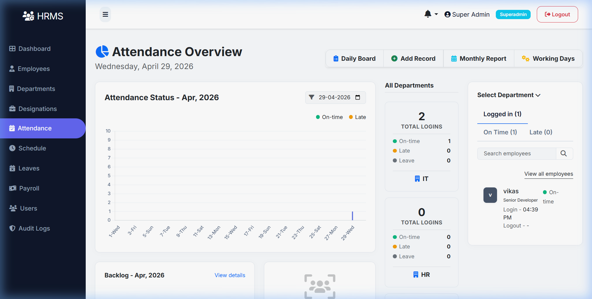
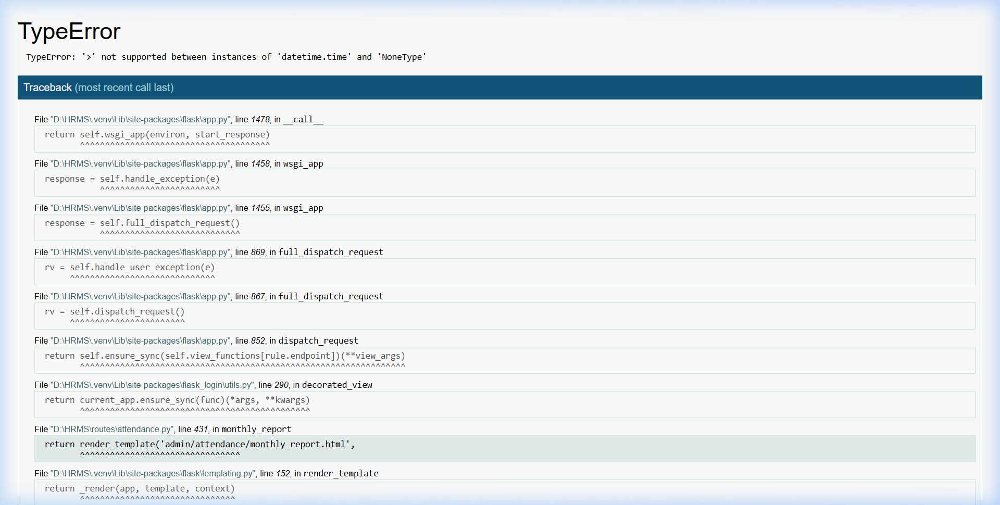
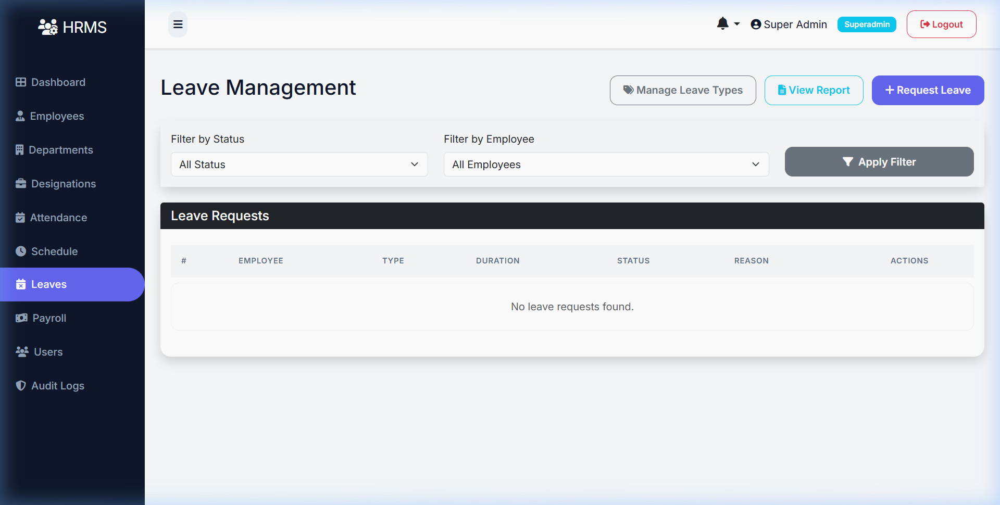
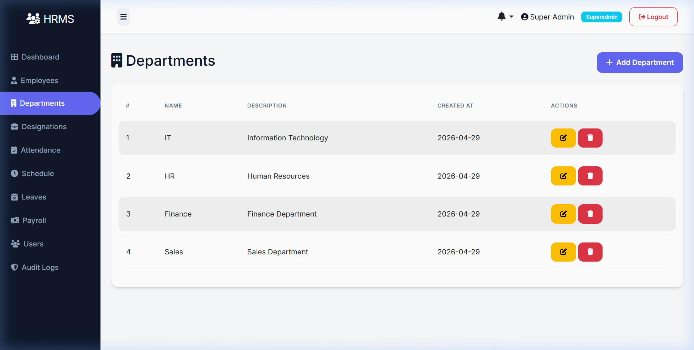

# 🏢 HRMS - Human Resource Management System

A comprehensive, modern HR Management System built with **Python Flask** and **Bootstrap 5**. Manage employees, attendance, leaves, payroll, departments, and more — all from a sleek, role-based admin dashboard.

[](https://python.org)
[](https://flask.palletsprojects.com)
[](https://getbootstrap.com)
[](LICENSE)

---

## 📸 Screenshots

### 🔐 Login Page
> Secure authentication with Employee ID or Email login, "Remember Me" support, and registration flow.



### 📊 Admin Dashboard
> Premium glassmorphism dashboard with real-time KPI cards, interactive Chart.js analytics (Salary Trends, Attendance Status, Leave Insights), and a quick-action Control Center.



### 👥 Employee Management
> Full employee lifecycle management — add, edit, view, and delete employee profiles with unique auto-generated Employee IDs.



### 📅 Attendance Tracking
> Daily attendance board with check-in/check-out, manual entry, and smart auto-generation for weekends, holidays, and approved leaves.



### 📈 Monthly Attendance Report
> Detailed monthly report with KPI summary cards, performance tables, and visual calendar views per employee.



### 🏖️ Leave Management
> Handle leave requests with approval workflows. Approved leaves auto-reflect in attendance records.



### 🏛️ Department Management
> Organize your workforce by departments with full CRUD operations.



---

## ✨ Features

### Core Modules
| Module | Description |
|--------|-------------|
| **Dashboard** | Glassmorphism admin dashboard with analytics charts and quick actions |
| **Employees** | Full CRUD with auto-generated IDs (`YYDEPTSERIAL` format) |
| **Attendance** | Check-in/out board, manual records, auto-generation engine |
| **Leaves** | Request/approve workflow with calendar integration |
| **Payroll** | Monthly salary calculation with allowances and deductions |
| **Departments** | Organizational unit management |
| **Designations** | Job title and role management |
| **Schedules** | Working hours configuration (Day/Night shifts) |
| **Documents** | Employee document storage and management |
| **Performance Reviews** | Employee performance tracking |

### System Features
| Feature | Description |
|---------|-------------|
| **Multi-Role Auth** | Superadmin, HR, Employee roles with granular permissions |
| **Smart Attendance** | Auto-generates records for holidays, weekends, and leaves |
| **Holiday Engine** | Holiday management that auto-reconciles attendance statuses |
| **Audit Logging** | Tracks all create/update/delete operations across models |
| **Notifications** | In-app notification system for payroll and leave events |
| **Employee Portal** | Self-service portal for employees to view their own data |

---

## 🚀 Quick Start

### Prerequisites
- Python 3.8+
- pip (Python package installer)

### 1. Clone the Repository
```bash
git clone https://github.com/vikasprajapat2/HRMS.git
cd HRMS
```

### 2. Setup Environment
```powershell
# Create virtual environment
python -m venv .venv

# Activate (Windows)
.venv\Scripts\activate

# Activate (Linux/Mac)
source .venv/bin/activate

# Install dependencies
pip install -r requirements.txt
```

### 3. Configure
Create a `.env` file in the root directory:
```env
SECRET_KEY=your-secret-key-change-in-production
# SQLite (default - no extra setup needed)
# MySQL (optional)
# MYSQL_USER=root
# MYSQL_PASSWORD=password
# MYSQL_HOST=127.0.0.1
# MYSQL_DATABASE=employee_management
```

### 4. Initialize Database
```powershell
# Run the app once to auto-create tables
python app.py

# Or use Flask-Migrate
$env:FLASK_APP = 'app.py'
flask db upgrade
```

### 5. Launch
```powershell
python app.py
```
Open **http://127.0.0.1:5000** in your browser.

---

## 🔑 Default Login Credentials

| Role | Username | Password | Access |
|------|----------|----------|--------|
| **Superadmin** | `admin@example.com` | `admin123` | Full system access |
| **Employee** | Employee ID (e.g. `2601001`) | Set by admin | Self-service portal |

> Run `python init_db.py` to create the default superadmin account and sample data.

---

## 🛠️ Tech Stack

| Layer | Technology |
|-------|-----------|
| **Backend** | Python 3.8+, Flask 3.0 |
| **Database** | SQLAlchemy ORM (SQLite / MySQL / PostgreSQL) |
| **Frontend** | Bootstrap 5, Chart.js, FontAwesome 6, Inter Font |
| **Auth** | Flask-Login, Flask-Bcrypt |
| **Migrations** | Flask-Migrate (Alembic) |
| **Production** | Gunicorn, Waitress |

---

## 📁 Project Structure

```
HRMS/
├── app.py                 # Application entry point
├── database.py            # SQLAlchemy database instance
├── models.py              # All database models
├── audit.py               # Audit logging listeners
├── init_db.py             # Database seeder script
├── requirements.txt       # Python dependencies
├── .env                   # Environment configuration
├── routes/                # All route blueprints
│   ├── admin.py           # Dashboard & admin routes
│   ├── auth.py            # Login/register/logout
│   ├── employee.py        # Employee CRUD
│   ├── attendance.py      # Attendance & holidays
│   ├── leave.py           # Leave management
│   ├── payroll.py         # Payroll processing
│   ├── department.py      # Department CRUD
│   ├── designation.py     # Designation CRUD
│   ├── user.py            # User management
│   ├── schedule.py        # Schedule management
│   ├── document.py        # Document management
│   ├── review.py          # Performance reviews
│   └── hr.py              # HR-specific routes
├── templates/             # Jinja2 HTML templates
│   ├── base.html          # Master layout
│   └── admin/             # Admin panel templates
├── static/                # CSS, JS, images
│   ├── css/style.css      # Custom styles
│   └── screenshots/       # App screenshots
├── migrations/            # Alembic migration files
└── instance/              # SQLite database (auto-created)
```

---

## 🔗 Key Routes

| Route | Method | Description |
|-------|--------|-------------|
| `/login` | GET/POST | User authentication |
| `/register` | GET/POST | New user registration |
| `/super` | GET | Superadmin dashboard |
| `/hr-manager` | GET | HR Manager dashboard |
| `/employee/` | GET | Employee list |
| `/employee/create` | GET/POST | Add new employee |
| `/attendance/` | GET | Attendance records |
| `/attendance/board` | GET | Quick check-in/out board |
| `/attendance/monthly-report` | GET | Monthly attendance report |
| `/attendance/holidays` | GET | Holiday management |
| `/leaves/` | GET | Leave requests |
| `/payroll/` | GET | Payroll records |
| `/payroll/create` | GET/POST | Generate payroll |
| `/department/` | GET | Department list |
| `/designation/` | GET | Designation list |
| `/users/` | GET | User management |
| `/audit-logs` | GET | System audit trail |

---

## 🤝 Contributing

Contributions are welcome! Please open an issue or submit a pull request.

1. Fork the repository
2. Create your feature branch (`git checkout -b feature/amazing-feature`)
3. Commit your changes (`git commit -m 'Add amazing feature'`)
4. Push to the branch (`git push origin feature/amazing-feature`)
5. Open a Pull Request

---

## 📄 License

This project is licensed under the **MIT License**.

---

> Built with ❤️ by [Vikas Prajapat](https://github.com/vikasprajapat2)
